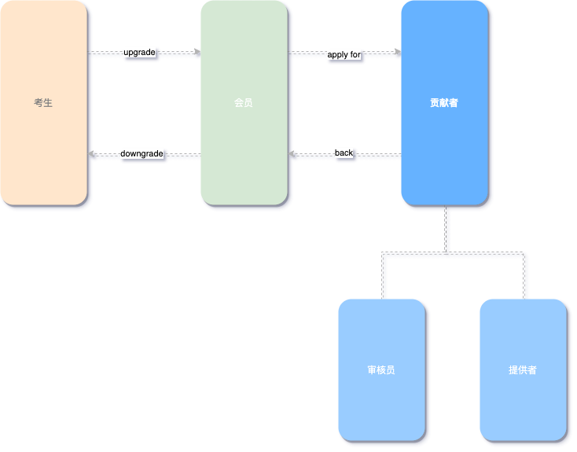

# Thickness

Thickness 表示市场的厚度，即可以存在多种不同类型的交互。交互往往指的是2个角色之间的互动行为，根据传统项目管理中定义的沟通渠道，可以理解一个生态环境中最多可以存在 $C^{2}_n$条可沟通渠道。 

但是`CertificateDAO`生态中存在着相关逻辑限制，使得其交互方式种类固定。

## 主要参与角色
在 `CertificateDAO`中主要存在以下种类的参与者：
- 0 - 考生
- 1 - 会员
- 2 - 贡献者

这里有一个相关角色的转换图

其中 考生的角色严格地讲，并不完全是 `CertificateDAO`的参与者，这是考试这一个动作或者行为会使得其与 `CertificateDAO`发生互动。

 `CertificateDAO`中主要最基础的角色是会员，在会员角色之上，可以转化为审核员、和贡献者；角色的转换并不是一个单向通道。审核员、贡献者也可以退格为会员。
正如物理世界当中的能力守恒定律一样：向上运动的过程会使得势能增加，动能减少。
会员升级为审核员、贡献者时也需要付出相应的努力。这一努力应该被`CertificateDAO`所见证。

会员、审核员、贡献者都是在`CertificateDAO`的`DFA`认证体系下，并不代表着`SCA`认证。这也意味着，即使你通过了`CertificateDAO`的`DFA`认证，在`SCA`认证中，其身份仍然不是会员。

成为会员的条件，其成为考生，通过认证考试，以取得`CertificateDAO`对你个人知识水平、能力、职业道德方面的认同。

## 交互模式
定义了市场中的角色，进一步地讨论一下关于角色之间的不同交互方式。这里以 「 考生 」作为**起点角色**，其他角色则可以是对应交互的**终点角色**。常见的交互方式有3种形式，后2种形式则是以第一种为基础衍生而来：
1.  考生 => 会员
2.  考生 => 会员 => 审核员
3.  考生 => 会员 => 贡献者

在`CertificateDAO`的`DFA` 和 `SCA`两种认证体系下，上述的交互方式均保持一致。
可以见得**审核员**和**贡献者**也都必须通过相应体系的认证。

